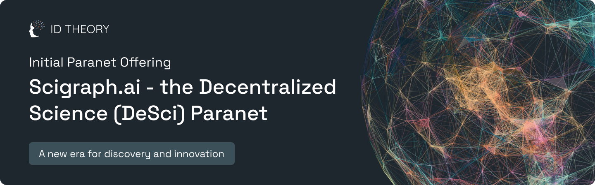
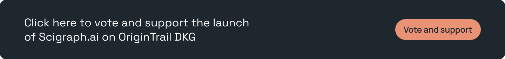
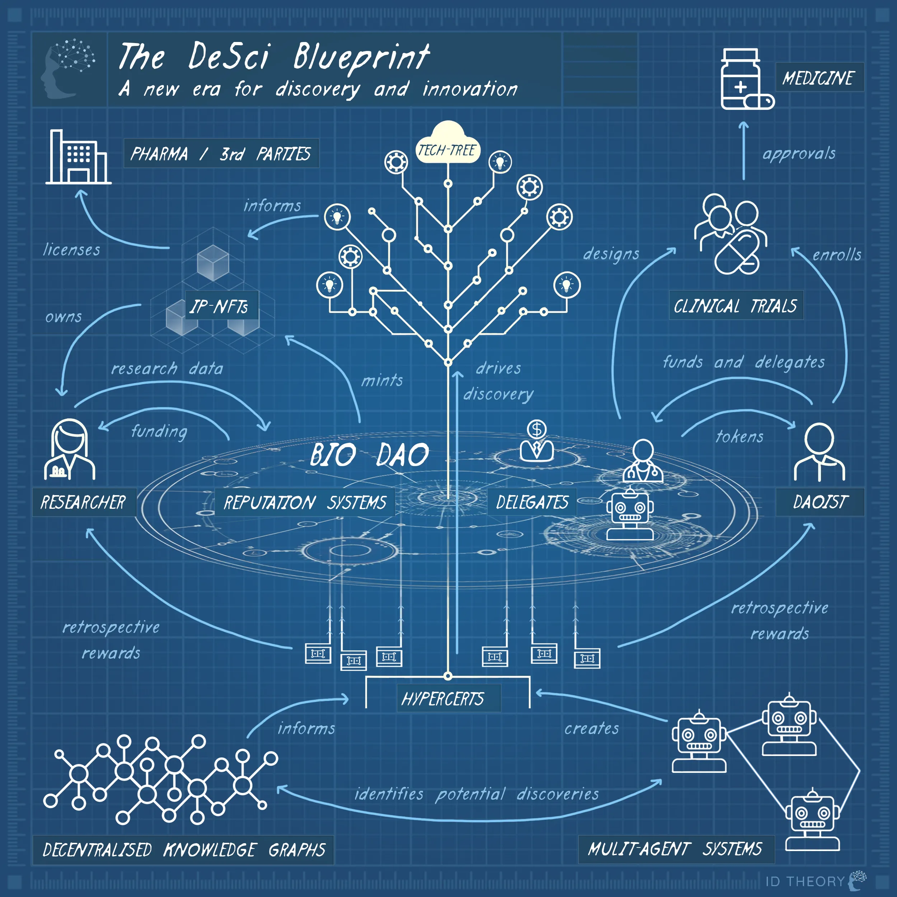
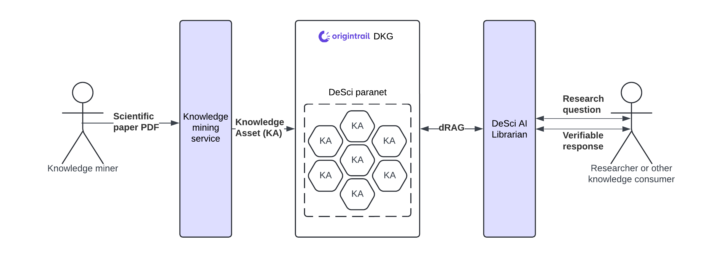

## General Paranet Information

**Short description:** Scigraph.ai - The Base for Decentralised Autonomous Science.

**Paranet Operator** ID Theory

**Paranet Blockchain:** Base

**Paranet Registry Knowledge Asset:** did:dkg:base:8453/0x3bdfa81079b2ba53a25a6641608e5e1e6c464597/290450

**Paranet incentive contract address:** 0x1600607c75ED84D07D06722c2Ded82EdA0237976

**Requested NEURO emissions:** 5,000,000 NEURO

**Discussion channel:** [ https://discord.gg/3BrQDvHpdc]( https://discord.gg/3BrQDvHpdc)

**Onchain publish date:**  October 23, 2024

## Context

The combination of artificial intelligence (AI) and decentralized science (DeSci) is set to revolutionize humanity’s ability to advance scientific research. While this transformation won't happen overnight, the current technological maturity enables us to take crucial steps today toward a brighter future.

Scientific “paradigm shifts” occur in [sudden, transformative steps](https://en.wikipedia.org/wiki/The_Structure_of_Scientific_Revolutions), not gradually. 

The future of science will be [autonomous](https://medium.com/id-theory/a-blueprint-for-breakthroughs-6a0818478acb) and transform [patients into stakeholders](https://medium.com/id-theory/pharma-is-fundamentally-flawed-8e490846ae3b?source=collection_home---4------3-----------------------).  

Imagine [trillions of AI agents](https://medium.com/id-theory/our-tam-is-bigger-than-yours-31dd4055d9d0) making continuous [scientific breakthroughs](https://medium.com/id-theory/serendipity-on-steroids-f4aa21495ee0?source=collection_home---4------2-----------------------), empowered by a state-of-the-art database populated with verified knowledge owned by its creator.

This is what the scigraph enables. 
The DeSci paranet aims to support the vision of autonomous research by providing several critical components:

* **Data verifiability and ownership**: Ensuring that research data is trustworthy and properly attributed.

* **Symbolic AI capabilities**: Leveraging the OriginTrail DKG for structured, logic-based AI.

* **Neural AI capabilities**: Utilizing Generative AI, such as Large Language Models (LLMs), for advanced data processing and insights.
Incentives for knowledge growth: Encouraging the expansion of valuable research.

By combining the trust and incentives, the deterministic foundation of the DKG, and the reasoning potential of LLMs, we can develop AI solutions that not only perform specific tasks but also undertake broader research initiatives. These AI agents can autonomously conduct research on verifiable sources, paving the way for new discoveries.

# **Problem**

Return on investment (ROI) for pharmaceutical research and development (R\&D) is plummeting due to skyrocketing costs, slow development processes, and high abandonment rates, leaving many potential breakthroughs unrealized. Decentralized science (DeSci) marks a new era of discovery by dismantling institutional and hierarchical barriers. Combined with AI, this approach can revolutionize R\&D, making it faster, more efficient, and more inclusive.

The DeSci paranet on the OriginTrail Decentralized Knowledge Graph (DKG) will serve as a decentralized hub for scientific knowledge, ensuring that all data is discoverable, verifiable, and properly attributed to its owners. This setup will enable DeSci AI services to facilitate scientific research by utilizing a broad spectrum of connected and verifiable knowledge while eliminating hallucinations, managing bias, and respecting the intellectual property of knowledge creators.

ID Theory will run specialized AI services on the DeSci paranet, allowing users to interact with and explore knowledge mined on the network. The first of these services, the DeSci AI Librarian, will enable users to navigate the knowledge on the DeSci Paranet using decentralized Retrieval-Augmented Generation (dRAG). As these services evolve, they will develop into comprehensive research frameworks for autonomous agents, paving the way for new scientific breakthroughs.

As it stands, LLMs are not well suited to create novel ideas, but rather randomize current human knowledge. Furthermore, their training sets have cut off points in the past, and so LLMs are unable to parse new information unless it is contained within their current ‘context window’. These factors severely limit discovery. Underpinning LLM activities with a DKG is a solution to this problem, and the two in tandem will enable AI agents to make genuinely novel scientific breakthroughs.
<table style="border-collapse: collapse; width: 100%;">
  <tr>
    <th style="background-color:#353744; color:white;">NEURAL AI (LLM)</th>
    <th style="background-color:#353744; color:white;">SYMBOLIC AI (DKG)</th>
  </tr>
  <tr>
    <td style="background-color:#ffcccc;"><strong>CONS</strong></td>
    <td style="background-color:#ccffcc;"><strong>PROS</strong></td>
  </tr>
  <tr>
    <td>Implicit Knowledge</td>
    <td>Structural Knowledge</td>
  </tr>
  <tr>
    <td>Hallucinations</td>
    <td>Accuracy</td>
  </tr>
  <tr>
    <td>Indecisiveness</td>
    <td>Decisiveness</td>
  </tr>
  <tr>
    <td>Black-box</td>
    <td>Interpretability</td>
  </tr>
  <tr>
    <td>Lacks Domain Specific/New Knowledge</td>
    <td>Domain Specific/New Knowledge</td>
  </tr>
  <tr>
    <td style="background-color:#ccffcc;"><strong>PROS</strong></td>
    <td style="background-color:#ffcccc;"><strong>CONS</strong></td>
  </tr>
  <tr>
    <td>General Knowledge</td>
    <td>Incompleteness</td>
  </tr>
  <tr>
    <td>Language Processing</td>
    <td>Lacks Language Understanding</td>
  </tr>
  <tr>
    <td>Generalisability</td>
    <td>Unseen Facts</td>
  </tr>
</table>

# **Paranet diagram**

# **Paranet Knowledge assets**

DeSci paranet Knowledge Assets will be created from scientific papers, initially focusing on neuroscience. This process will use the Knowledge Mining AI service (described below), where knowledge miners will submit papers in PDF format, the standard format for scientific literature. These papers will be transformed into Knowledge Assets on the DeSci Paranet using various ontologies (listed below), ensuring the creation of semantically rich, interconnected scientific papers. This approach will enhance both the depth and accessibility of research within the DeSci paranet.

## Ontologies and data structure

Knowledge in the DeSci paranet will be structured around the following ontologies:

* [SPAR ontologies](http://www.sparontologies.net/)  
* [OBI ontology](https://obi-ontology.org/)  
* [Gene ontology](http://geneontology.org/)  
* [DOID ontology](https://www.disease-ontology.org/)  
* [ChEBI ontology](https://www.ebi.ac.uk/chebi/)  
* [ATC ontology](https://bioportal.bioontology.org/ontologies/ATC)

## Examples of Knowledge Assets for the IPO

* [https://dkg-testnet.origintrail.io/explore?ual=did:dkg:base:84532/0x9e3071dc0730cb6dd0ce42969396d716ea33e7e1/75023](https://dkg-testnet.origintrail.io/explore?ual=did:dkg:base:84532/0x9e3071dc0730cb6dd0ce42969396d716ea33e7e1/75023)  
* [https://dkg-testnet.origintrail.io/explore?ual=did:dkg:base:84532/0x9e3071dc0730cb6dd0ce42969396d716ea33e7e1/75010](https://dkg-testnet.origintrail.io/explore?ual=did:dkg:base:84532/0x9e3071dc0730cb6dd0ce42969396d716ea33e7e1/75010)  
* [https://dkg-testnet.origintrail.io/explore?ual=did:dkg:base:84532/0x9e3071dc0730cb6dd0ce42969396d716ea33e7e1/71201](https://dkg-testnet.origintrail.io/explore?ual=did:dkg:base:84532/0x9e3071dc0730cb6dd0ce42969396d716ea33e7e1/71201)

# **Paranet services**

## Knowledge mining service

**Service description:** The Knowledge mining service allows knowledge miners to contribute to the DeSci paranet by submitting scientific papers in PDF format. AI agents, each specializing in a specific ontology, extract and process data from these papers. The extracted data is then converted into JSON-LD format, provided for review to the knowledge miner, and finally published as a Knowledge Asset on the DeSci Paranet.  
**Objective:** Providing knowledge miners with a streamlined way of contributing high-quality Knowledge Assets to the DeSci paranet.  
**Service type:** off-chain (processing of PDF papers) and on-chain (publishing of Knowledge Assets into the DeSci paranet)  
**Service endpoint URL:** https://scigraph.ai  
**Service specification URL:** [ID Theory paranet - Knowledge mining service](https://docs.google.com/document/d/1_Da2cISevYlRzjzl7HTZfE3lRsfiC32A9RxFLA9BKm0/edit?usp=sharing)  
**Service launch date:** October 2024\.

## DeSci AI Librarian

**Service description:** Powered by decentralized Retrieval Augmented Generation (dRAG), the DeSci AI Librarian will enable researchers and other knowledge consumers to explore the DeSci Paranet using natural language. This service will streamline how researchers find the latest developments in specific scientific fields, conduct further research, locate citations for their work, build upon existing studies, and identify research gaps.  
**Objective:** Empower researchers and other knowledge consumers to seamlessly discover and interact with scientific papers in the DeSci Paranet using natural language.  
**Service type:** off-chain  
**Service endpoint URL:** https://scigraph.ai  
**Service specification URL:** [ID Theory paranet - DeSci AI Assistant](https://docs.google.com/document/d/1qnjAuONo4a-OSXN57ZEpTBCAPSjwwnsueRFilX9Sr4s/edit?usp=sharing)  
**Service launch date:** October 2024\.

# **NEURO Incentives**

## Overview

The NEURO Incentives program is designed to reward contributors to the DeSci paranet. A total of 5,000,000 NEURO incentives are requested for this IPO. 

A significant portion \- 75% (3,750,000 NEURO) of the incentives are allocated to knowledge miners contributing knowledge assets to the paranet. Additionally, 5% of the incentives are set aside for voters to encourage active participation in governance, and 20% are allocated to the paranet operator (ID Theory). 

We expect the process to be iterative, with potential future NEURO emission requests after this initial IPO.

## Incentive structure

**NEURO Emissions requested:** (Total amount of NEURO): **5,000,000 NEURO**  
**Knowledge mining rewards amount:** (How many NEURO emissions per TRAC spent for Knowledge mining): 100  
**Knowledge miner rewards:** (What percentage of total NEURO will be distributed to knowledge miners): 75%  
**Paranet operator rewards:** (What percentage of total NEURO emissions will be allocated to the Paranet operator): 20%.   
*Note: Out of 20% of NEURO rewards allocated to the paranet operator, 10% (half of the operator rewards) will be distributed to the community as marketing rewards and used in a targeted way to improve the paranet quality (e.g. additionally rewarding miners who contribute more in-demand knowledge).*  
**NEURO voters rewards:** (What percentage of total NEURO emissions will be allocated to the NEURO voters): 5%

# **Marketing plan**

* Raising awareness about the scigraph with advertising on social media platforms.  
* Optimizing scigraph.ai website and content to rank higher in Search Engine Optimization (SEO).  
* Engaging in joint marketing campaigns with the Base teams to promote the scigraph.  
* Creating valuable, relevant, and consistent content such as blogs, videos, podcasts, to attract and engage with a relevant audience.  
* Using email campaigns and newsletters to provide valuable content to the community and promote the scigraphs capabilities.  
* Collaborating with influencers and DAOs to the scigraphs features to their audience.  
* Public Relations (PR): Promoting scigraph through media relations, press releases, and events.  
* Engaging with and building a community around a forum and other relevant online groups.  
* Hosting online webinars and podcasts to educate about scigraph.  
* Participating in or sponsoring web3, crypto, and other relevant industry events and conferences to increase scigraphs visibility and network with the community.
