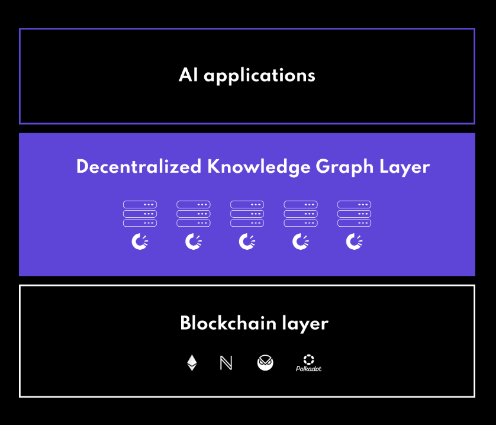

# Initial Paranet Offering - Polkabot

## General Paranet Information

**Short description:** Decentralized AI hub on Polkadot

**Paranet Blockchain:** NeuroWeb

**Paranet Registry Knowledge Asset:** did:dkg:otp:2043/0x5cac41237127f94c2d21dae0b14bfefa99880630/7683370

**Paranet incentive contract address:** 0xd9a0eC693ebf736b8b9980AECd4a614c66bdf853

**Requested NEURO emissions:** 312 500 NEURO

**Discussion channel:** [https://discord.com/invite/QctFuPCMew](https://discord.com/invite/QctFuPCMew)

**Onchain publish date:**  15.7.2024.

## Context

The knowledge revolution sparked by the explosive rise of Artificial Intelligence is promising to significantly improve the way we learn and consume information. However, to fulfill that promise we have to address some of the key shortfalls of using generative AI systems on their own, such as hallucinations, bias, mishandling of intellectual property rights, and even potential AI model collapse.

**[Polkabot.AI](http://Polkabot.AI) - Decentralized AI education hub on Polkadot** is achieving that by leveraging the neuro-symbolic OriginTrail Decentralized Knowledge Graph (DKG). The solution revolutionizes how anyone can interact and learn about the Polkadot ecosystem, whether a novice getting through the first steps or a seasoned user looking for the latest updates. It achieves that by allowing a wider Polkadot ecosystem to get involved in creating a trusted knowledge base that Polkabot’s AI system uses to construct its responses. Unlike the solutions using solely generative AI, Polkabot is implementing a decentralized retrieval-augmented generation (D-RAG) approach leveraging the OriginTrail DKG. Instead of the Polkabot solely relying on AI to produce a generated response, it uses AI to construct a response based on trusted inputs from the DKG populated by the wider Polkadot community. 

## Problem

The Polkabot paranet aims to provide a trusted education hub for the Polkadot community through an easy to use AI interface based on knowledge crowdsourced by the Polkadot community.

By leveraging the OriginTrail Decentralized Knowledge Graph (DKG), Polkabot ensures that responses are constructed based on trusted, decentralized knowledge contributed by the community. This approach mitigates the risks associated with using generative AI alone by providing a robust foundation of verified information.

Additionally, Polkabot is set to become the main hub for building decentralized AI applications within the Polkadot ecosystem. It provides a platform where developers and users can create, interact with, and benefit from decentralized AI solutions. This resource fosters innovation and collaboration, making it easier to develop AI applications that are secure, transparent, and community-driven.

## Paranet diagram

## Paranet Knowledge assets

Because of sourcing information directly from websites, the proposed structure for knowledge assets of the Polkabot paranet follows the Schema.org vocabulary. Knowledge assets relevant for the paranet include various structured data types such as CreativeWorks, NewsArticles, and more, which are essential for building a robust and reliable knowledge base.

### Ontologies and data structure

_List the ontologies you expect the Knowledge Miners to use, including any other recommendations when structuring data for knowledge assets._

Schema.org focused:
* WebSite
* WebPage
* BlogPosting
* CreativeWork
* NewsArticle
* Article
* Report
* Person
* Organization
* Event
* MediaObject
* AudioObject
* VideoObject
* Comment
* Review
* Thing

### Examples of Knowledge Assets for the IPO

* [did:dkg:otp:2043/0x5cac41237127f94c2d21dae0b14bfefa99880630/7071148](https://dkg.origintrail.io/explore?ual=did:dkg:otp:2043/0x5cac41237127f94c2d21dae0b14bfefa99880630/7071148)
* [did:dkg:otp:2043/0x5cac41237127f94c2d21dae0b14bfefa99880630/3720980](https://dkg.origintrail.io/explore?ual=did:dkg:otp:2043/0x5cac41237127f94c2d21dae0b14bfefa99880630/3720980)
* [did:dkg:otp:2043/0x5cac41237127f94c2d21dae0b14bfefa99880630/7071566](https://dkg.origintrail.io/explore?ual=did:dkg:otp:2043/0x5cac41237127f94c2d21dae0b14bfefa99880630/7071566)
* [did:dkg:otp:2043/0x5cac41237127f94c2d21dae0b14bfefa99880630/4227637](https://dkg.origintrail.io/explore?ual=did:dkg:otp:2043/0x5cac41237127f94c2d21dae0b14bfefa99880630/4227637)

## Paranet services

### Polkabot.AI 

**Service description:** The PolkaBot.AI - Decentralized AI education hub on Polkadot is a novel approach towards automating education based on verifiable knowledge maintained for the community by the community. Polkabot is an AI-powered solution developed on the very technological fundamentals that are supposed to be instilled throughout the learning process.

**Objective:** It will be used within the Polkadot ecosystem, or leveraged for outward communication - allowing anyone to tap into the trusted knowledge and produce relevant responses as they’re interacting online (e.g. X platform).

**Service type:** off-chain

**Service endpoint URL:** [https://polkabot.ai/](https://polkabot.ai/)

**Service specification URL:** [Polkabot.ai](https://docs.google.com/document/d/1hKX0hT1xm5jRrfOEnixYjY7zsVDEzpTD8BiHvpcxYQI/edit#heading=h.47kmd9au2r5q)

**Service launch date:** March 2024.

## NEURO Incentives

### Overview

The NEURO Incentives program is designed to reward contributors within the Polkadot ecosystem. A total of 312 500 NEURO incentives are requested for this IPO. 

A significant portion - 80% (250,000 NEURO) of the incentives are allocated to knowledge miners contributing knowledge assets for the paranet. Additionally, 10% of the incentives are set aside for voters to encourage active participation in governance, and 10% are allocated to the paranet operator (Trace Labs). 

Additionally, on top of NEURO rewards, a total of 3000 DOT will be distributed to the best contributors according to their contributions by Trace Labs.

We expect the process to be iterative, with potential future NEURO emission requests after this initial IPO.

### Incentive structure

**Initial Paranet Offering emission deadline:** (unix timestamp) 1731072427

**NEURO Emissions requested:** (Total amount of NEURO) **312 500 NEURO**

**Knowledge miner rewards:** (What percentage of total NEURO will be distributed to knowledge miners) 80%

**Knowledge mining rewards amount:** (How many NEURO emissions per TRAC spent for Knowledge mining) 20

**Paranet operator rewards:** (What percentage of total NEURO emissions will be allocated to the Paranet operator) 10%

**NEURO voters rewards:** (What percentage of total NEURO emissions will be allocated to the NEURO voters) 10%

## Marketing plan

* Raising awareness about PolkaBot.AI and the Polkabot paranet with advertising on social media platforms.
* Create a Polkadot-focused Trace Alliance course and introduce PolkaBot.AI as a learning assistant.
* Support the course with a learn-and-earn campaign.
* Optimizing PolkaBot.ai website and content to rank higher in Search Engine Optimization (SEO).
* Creating valuable, relevant, and consistent content such as blogs, videos, podcasts, to attract and engage with a relevant audience.
* Using email campaigns and newsletters to provide valuable content to the community and promote PolkaBot's capabilities.
* Collaborating with influencers to promote PolkaBot's features to their audience.
* Public Relations (PR): Promoting PolkaBot through media relations, press releases, and events.
* Engaging with and building a community around PolkaBot through Polkadot forum and other relevant online groups.
* Hosting online webinars and podcasts to educate about PolkaBot.
* Participating in or sponsoring web3, crypto, and other relevant industry events and conferences to increase PolkaBot's visibility and network with the community.

## Other

This is the first Polkabot Initial Paranet Offering (IPO), marking the beginning of an iterative process aimed at refining the NEURO Incentives program. We anticipate that there will be more iterations in the future, incorporating improvements based on the insights and learnings gained from this initial IPO. Our goal is to continuously evolve the Polkabot Paranet to better serve the community and maximize the value created within the NeuroWeb and Polkadot ecosystems.
